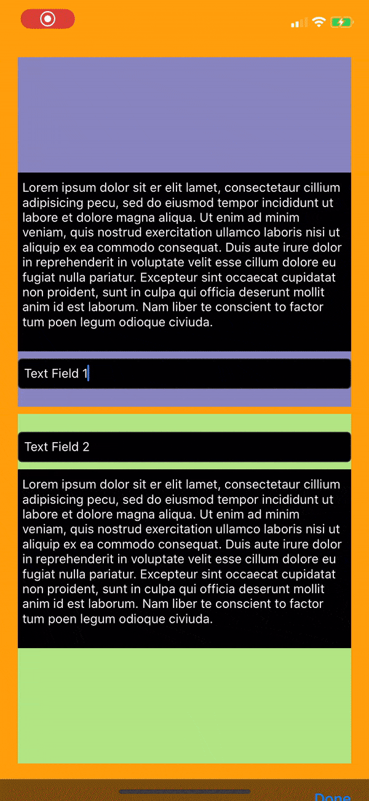

# RGDoneKeyboard

[](https://travis-ci.org/iRohitGaur/RGDoneKeyboard)
[](https://cocoapods.org/pods/RGDoneKeyboard)
[](https://cocoapods.org/pods/RGDoneKeyboard)
[](https://cocoapods.org/pods/RGDoneKeyboard)

## Example

To run the example project, clone the repo, and run `pod install` from the Example directory first.



## Installation

RGDoneKeyboard is available through [CocoaPods](https://cocoapods.org). To install
it, simply add the following line to your Podfile:

```ruby
pod 'RGDoneKeyboard'
```

## Usage

Turn on the accessory in storyboard. For details, check these videos:

<a href="https://www.youtube.com/playlist?list=PLSyUY9cUrmozWHqIRZ1UULgcdl2SAJCY2"></a>

Import it in the ViewController you want it to work:

```ruby
import RGDoneKeyboard
```
In your viewDidLoad function, call RGDoneKeyboard on self:

```ruby
self.RGDoneKeyboard(dismissOnTap: true)
```
If you want to dismiss the keyboard when you tap on the view, you can set dismissOnTap as true.

## Author

iRohitGaur, rohitgaur7@gmail.com

## License

RGDoneKeyboard is available under the MIT license. See the LICENSE file for more info.
